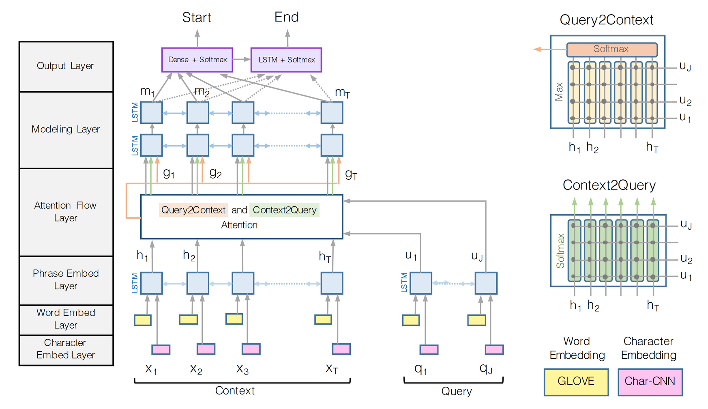
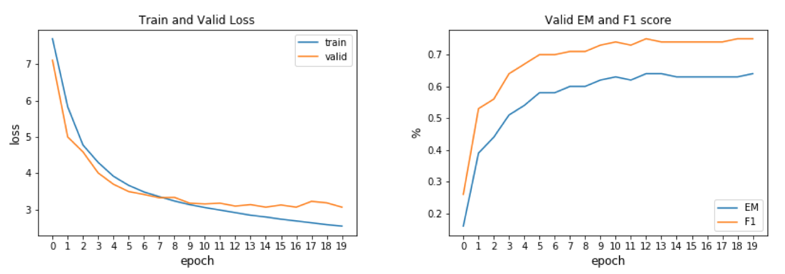

# Question Answering with SQuAD

The goal of this project was for me to get familiar with the Question Answering task, a very active topic in NLP research.

To this end, I implemented a Bidirectional Attention Flow neural network as a baseline, improving Chris Chute's model [implementation](https://github.com/chrischute/squad/models.py), adding word-character inputs as described in the original paper.

I found this project very useful from a learning perspective so I highly recommend you to dig into the code and work on improving this baseline.

You can reproduce the work following the Set-Up section, and potentially (recommended!) train the model on a single GPU setting the `cuda` variable in `config.py` to `True`.

# Model Architecture

Source: [BiDAF paper](https://arxiv.org/abs/1611.01603)

# Code Organization

    ├── config.py          <- Configuration file with data directories and hyperparamters to train the model
    ├── data_loader.py     <- Define an iterator who collects batches of data to train the model
    ├── eval.py            <- Evaluate the model on a new pair of (context, question)
    ├── layers.py          <- Define the various layers to be used by the main BiDAF model
    ├── make_dataset.py    <- Download the SquAD dataset and pre-process the data for training
    ├── model.py.          <- Define the BiDAF model architecture
    ├── requirements.txt   <- Required Python libraries to build the project
    ├── test.py            <- Test the performance of a trained model on the DEV dataset
    ├── train.py           <- Train a model using the TRAIN dataset only
    ├── utils.py           <- Group a bunch of useful functions to process the data

# Results

Exact-Match and F1 Score on Validation set after training:

| EM  | F1  |
| ----|:---:|
| 0.64| 0.75|

# Set-Up

* Clone the repository
* Create a directory for your experiments, logs and model weights: `mkdir output`
* Download GloVE word vectors: https://nlp.stanford.edu/projects/glove/
* Modify the `config.py` file to set up the paths where your GloVE, SquAD and models will be located
* Create a Python virtual environment, source to it: `mkvirualenv qa-env ; workon qa-env` if you use virtualenvwrapper
* Install the dependencies: `pip install -r requirements.txt ; python -m spacy download en`
* Run `python make_dataset.py` to download SquAD dataset and pre-process the data
* Run `python train.py` to train the model with hyper-parameters found in `config.py`
* Run `python test.py` to test the model EM and F1 scores on Dev examples
* Play with `eval.py` to answer your own questions! :)

# Next Steps
 
- [ ] set up a variable to choose between training the model with word only VS word + characters
- [ ] collect the moving average of the weights during training and use them during testing
- [ ] add the ability to train the model on multiple GPUs, and offer half-precision training to speed-up the training
- [ ] improve this baseline using pre-training encoding such as BERT, and/or set-up a multi-task learning pipeline to jointly learn to answer questions together with another closely related NLP task.

# Resources

* SQuAD dataset: https://arxiv.org/abs/1606.05250
* Bidirectional Attention Flow for Machine Comprehension"
by Minjoon Seo, Aniruddha Kembhavi, Ali Farhadi, Hannaneh Hajishirzi : https://arxiv.org/abs/1611.01603
* Authors' TensorFlow implementation: https://allenai.github.io/bi-att-flow/
* BERT: Pre-training of Deep Bidirectional Transformers for Language Understanding
Jacob Devlin, Ming-Wei Chang, Kenton Lee, Kristina Toutanova : https://arxiv.org/abs/1810.04805
* BiDAF baseline model: https://github.com/chrischute/squad
* PyTorch pretrained BERT: https://github.com/huggingface/pytorch-pretrained-BERT
* GloVE: https://nlp.stanford.edu/projects/glove/
